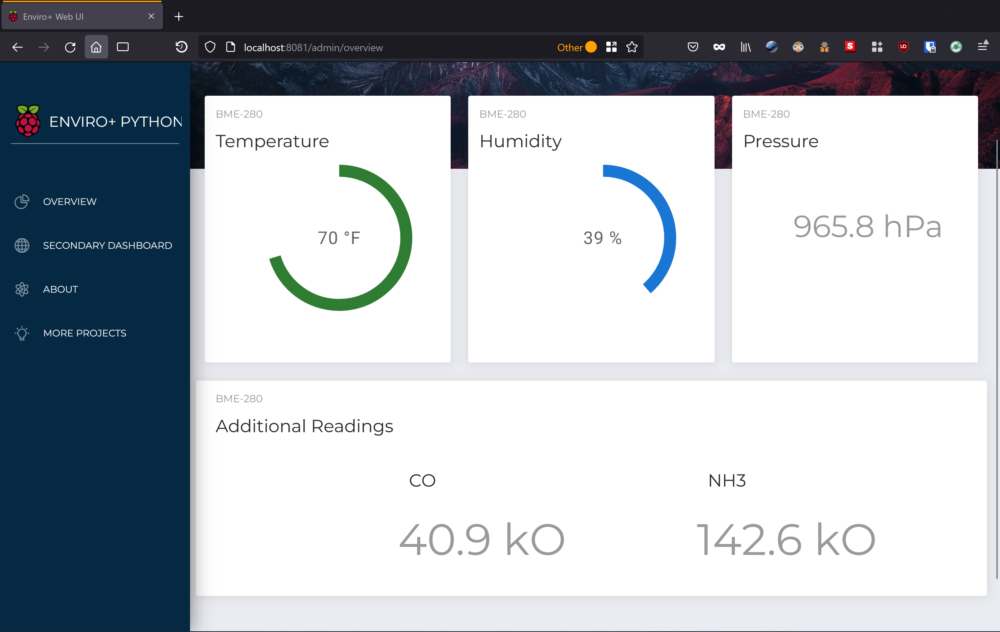

# Enviro Plus Web Dashboard
[](https://pypi.python.org/pypi/enviroplus)
[](https://nodejs.org/en/download/)
[](https://reactjs.org/docs/getting-started.html)

<br>

 

The goal of this project is to offer another exciting way to utilize the excellent Enviro Plus HAT from Pimoroni, while giving
each maker, teacher, student, or enthusiast the opportunity to dig into the source code to better understand the inner workings
of the application.

The various walkthroughs and code examples provided by Pimoroni are an outstanding way for educators and makers alike to get started
quickly using boards such as the Enviro Plus HAT, but what about next steps? What are the steps needed to go beyond command line 
scripts, and on to more UI-based applications? That's usually up to the maker to figure out since each scenario is different. 


### What's better than having to figure out these steps? How about having a next-level application like this to learn from!

<br>

**NOTE:** This branch of the project is intended to run on a Raspberry Pi to be displayed either on an attached display screen or monitor/tv. Another more complex branch is currently being worked on to allow for viewing the dashboard from any other device on the same network. Stay tuned for when it becomes available if that's something you would like to be able to do!

<br>

## Building Blocks

This project utilizes React as the front end user interface, and Flask on the back end. The primary reason for using Flask, if it isn't obvious,
is that it's a Python server microframework. This works out great since the Enviro Plus uses a large Python codebase for easy programmatic 
operations.

The React front end is built on top of an excellent template coded by <a href="https://www.creative-tim.com">Creative Tim</a>, but only utilizes a fraction of the capablilities that the original template included...mainly because it wasn't needed for this particular application. <u>Anyone looking for a great starting point for  a React project should definitely check out their awesome templates!</u>

<br>

## Quick Start

- Make sure you have already gone through the setup process for the enviroplus-python repo install (**see below**)
- Follow a few quick steps to install the current LTS version on NodeJS (version in `apt` is too old -> **see below**)
- `Yarn` is the preferred manager over `npm`, so if using NPM, **adjust the setup and start scripts accordingly**!
- `git clone https://gitlab.com/dedSyn4ps3/enviroplus-web-ui.git && cd enviroplus-web-ui`
- `chmod +x setup.sh start.sh`
- `./setup.sh` to setup dependencies
- `./start.sh` to run a small script to get everything up and running!
- Open a browser on your Pi and visit <a href="http://localhost:8081">http://localhost:8081</a>

<br>

## Enviro-Plus Install Script

```bash
curl -sSL https://get.pimoroni.com/enviroplus | bash
```

### Alternative -> Install and Configure from GitHub

* `git clone https://github.com/pimoroni/enviroplus-python`
* `cd enviroplus-python`
* `sudo ./install.sh`

**Note:** Raspbian/Raspberry Pi OS Lite users may first need to install git: `sudo apt install git`

<br>

## Resources
- Learning Guides - https://learn.pimoroni.com/
* Support Forums - https://forums.pimoroni.com/c/support
- Other Services - https://www.nullreturn-it.com
- Creative Tim - https://demos.creative-tim.com/

 <h3>Support & Other Questions</h3>

 If you have questions or would like more info on how to set up your project, feel free to [reach out](mailto:support@nullsecurity.tech).

<br>

## Licensing

- Copyright 2022 dedSyn4ps3 (github.com/dedsyn4ps3)
- Licensed under MIT

### This project is built on a skeleton using components designed by Creative Tim

*Any use, re-use, and adaptations of this project and it's code shall include the above license as well as credit for the components used that were adapted from Creative Tim's work...*

- Copyright 2021 Creative Tim (https://www.creative-tim.com)
- Licensed under MIT (https://github.com/creativetimofficial/now-ui-dashboard-react/blob/main/LICENSE.md)
